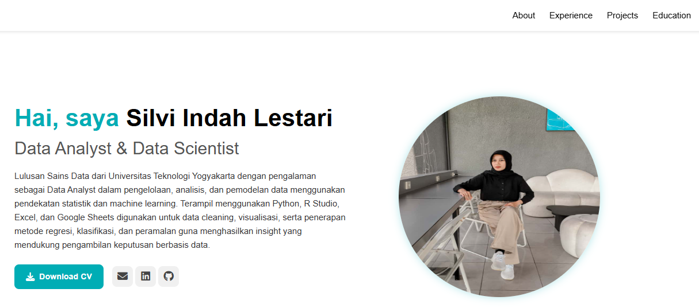

# 🌸 Silvi Indah Lestari | Portfolio Website

Selamat datang di portfolio saya!  
Website ini menampilkan profil, pengalaman, dan project data analysis saya.

🔗 **Lihat Website Live:**  
👉 [https://indahsilvi393-lang.github.io/portofolio/](https://indahsilvi393-lang.github.io/portofolio/)

---

## 🖼️ Tampilan Portfolio

---

## 🧠 Tentang Saya
Hai, saya **Silvi Indah Lestari**, seorang *Data Analyst & Data Scientist*.  
Lulusan **Sains Data - Universitas Teknologi Yogyakarta**, berpengalaman dalam:
- Analisis data, cleaning, dan visualisasi
- Pemodelan prediktif menggunakan *Machine Learning*
- Tools: **Python**, **R Studio**, **Excel**, dan **Google Sheets**

---

## 📊 Beberapa Proyek Saya
| Project | Tools | Deskripsi Singkat |
|----------|--------|------------------|
| 📈 Prediksi Biaya Asuransi | Python, Scikit-learn | Memprediksi biaya klaim asuransi berdasarkan faktor demografis |
| 💹 Dashboard Penjualan | Google Sheets | Dashboard interaktif untuk analisis performa penjualan |
| 🏠 Analisis Harga Rumah | Power BI | Analisis faktor-faktor yang memengaruhi harga rumah |

---

## 🧰 Teknologi yang Digunakan
- HTML, CSS, JavaScript (untuk website ini)
- GitHub Pages untuk hosting

---

✨ Terima kasih sudah berkunjung ke portfolio saya!  
📬 Jika ingin berkolaborasi: **[Email saya di sini](mailto:silviindahlestari@gmail.com)**  
